### *A Low-cost Joystick, Gesture & Voice Controlled Smart Wheelchair*

### *Features*
- With a simple mobile application connected to the car by bluetooth, the car/wheelchair can be controlled using:
  1. ***Joystick:*** A virtual joystick in the app.
  2. ***Gesture:*** Using phone's built-in accelerometer. Joystick control is achieved by tilting the phone.
  3. ***Voice command:*** Listens for Forward, Backward, Right, Left for direction control of the car.<br>Voice command can be triggered by shaking the phone.
- Direction control as well as speed control of the car.
- Shows distance of the backward objects & sends caution signal on the app for backward collison.

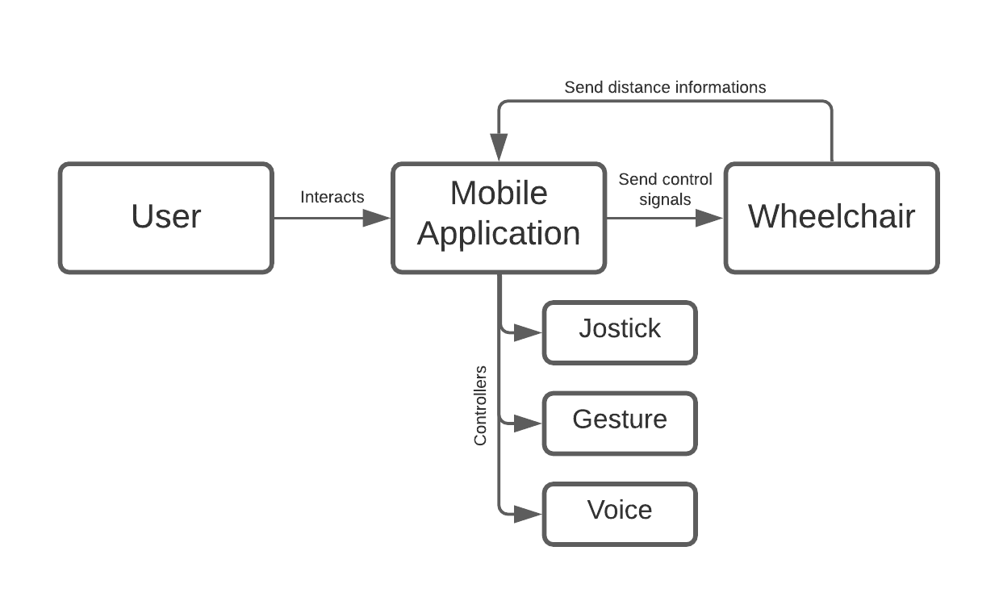

<br>

### *Mobile Application*
Mobile application was developed using [MIT App Inventor](https://appinventor.mit.edu/) which connects to the car via bluetooth.

##### *A demo of the application:*

<table>
  <tr>
    <th>
      <i>Applocker</i>
    </th>
  </tr>
  <tr>
    <td width=25%>
      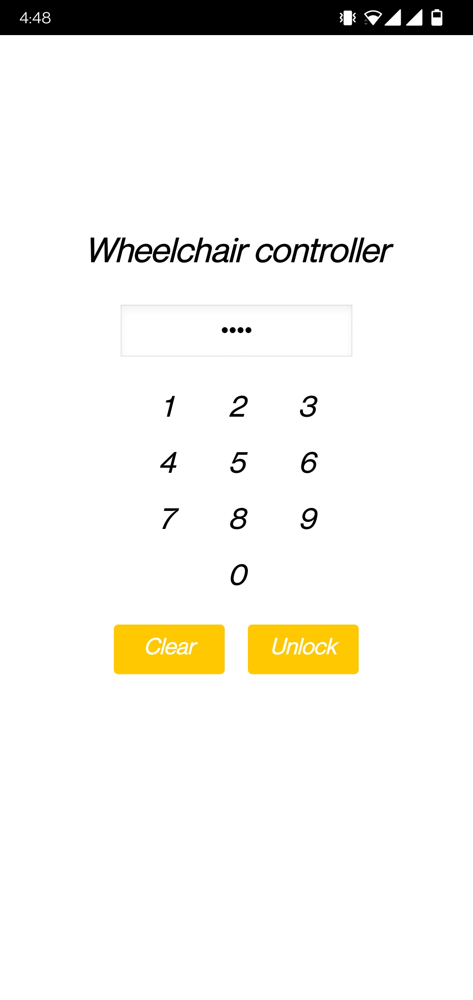
    </td>
  </tr>
  <tr>
    <th>
      <i>Connect bluetooth module</i>
    </th>
  </tr>
  <tr>
    <td width=25%>
      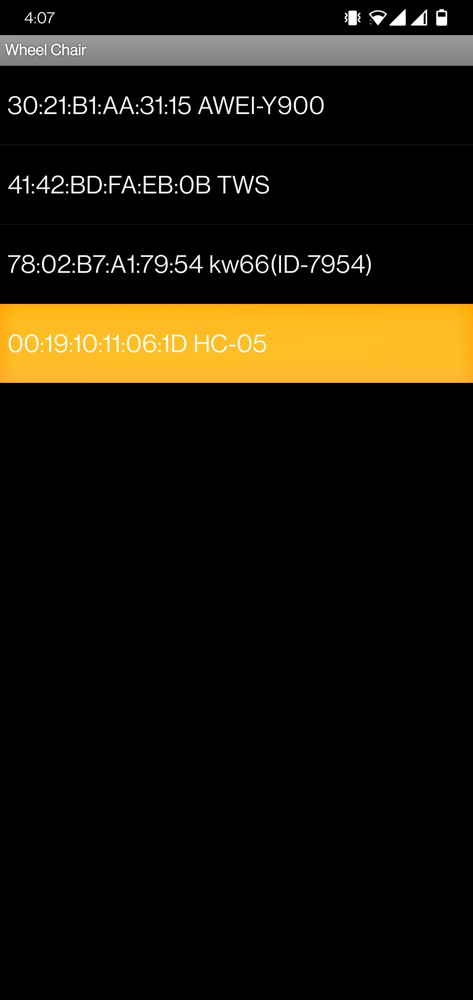
    </td>
  </tr>
  <tr>
    <th>
      <i>Joystick control</i>
    </th>
    <th>
      <i>Gesture control</i>
    </th>
    <th colspan=2>
      <i>Voice control</i>
    </th>
  </tr>
  <tr>
    <td width=25%>
      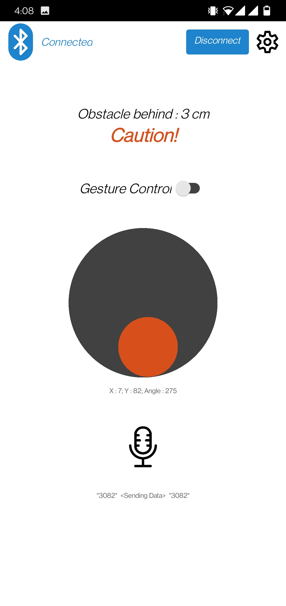
    </td>
    <td width=25%>
      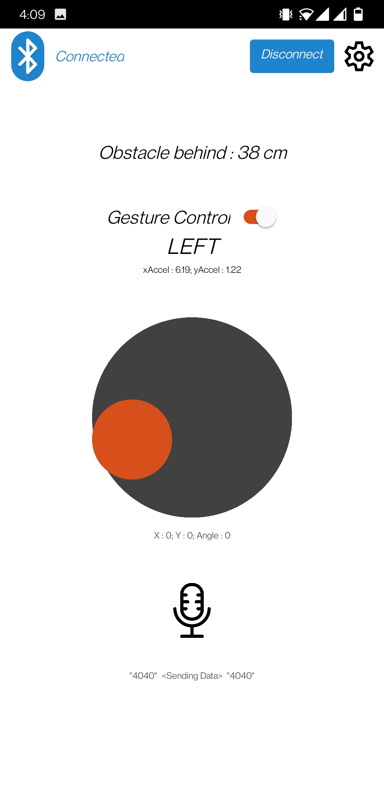
    </td>
    <td width=25%>
      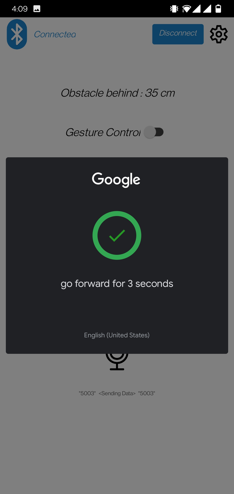
    </td>
    <td width=25%>
      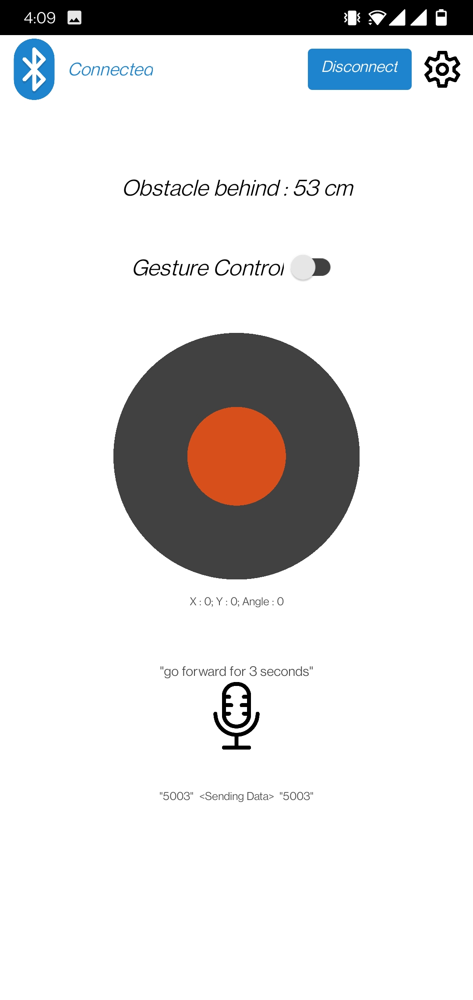
    </td>
  </tr>
  <tr>
    <th>
      <i>Setting configurations</i>
    </th>
  </tr>
  <tr>
    <td  width=25%>
      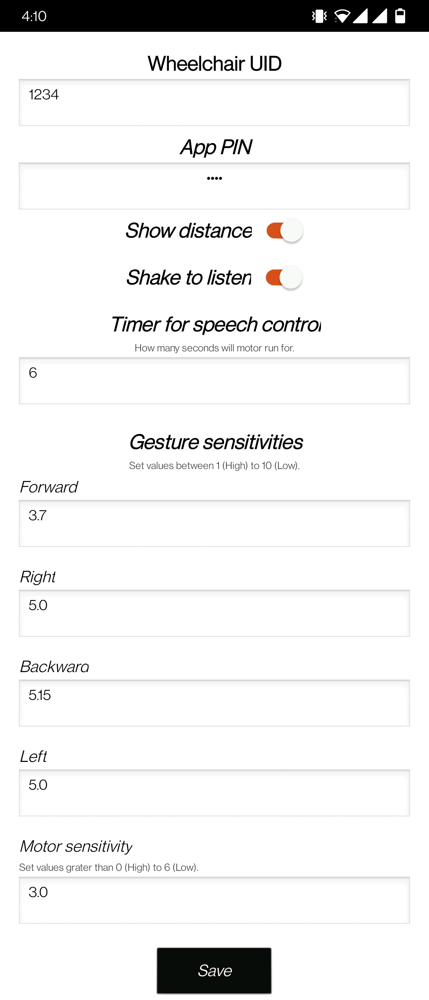
    </td>
  </tr>
</table>

<br>

### *Hardware Requirements*
- ***Microcontroller:*** Arduino UNO
- ***Motors:*** DC motors (9V)
- ***Motor driver:*** L298N DC motor driver
- ***Bluetooth module:*** HC-05
- ***Ultrasonic sensor:*** HC-SR04
- ***DC power source:*** 9V battery / Power bank

##### *Connection diagram*
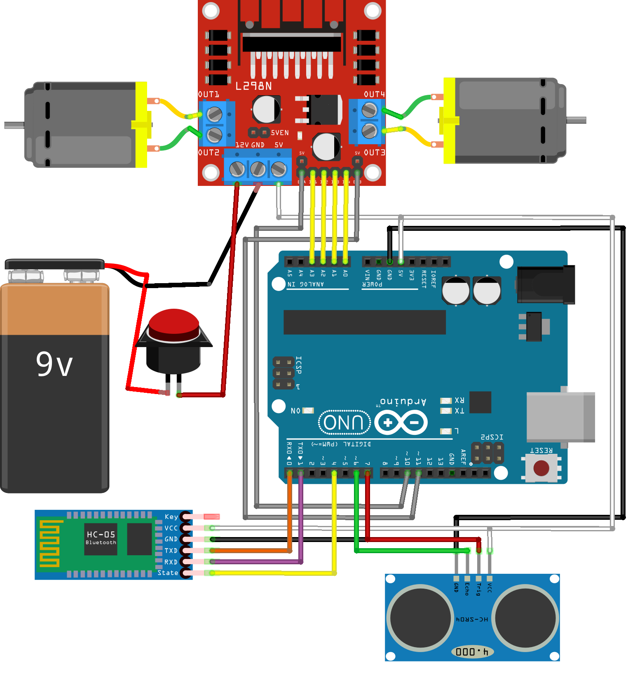

<br>

### *How to run*
1. Assemble hardware components according to [connection diagram](#connection-diagram).
2. Upload code `main/main.ino` to Arduino.
3. Install `wheel_chair_app.apk` on Android.<br>For iOS, import `wheel_chair_app.aia` in [MIT App Inventor](http://ai2.appinventor.mit.edu/) and read [this post](https://appinventor.mit.edu/blogs/evan/2021/03/04-mit-app-inventor-ios-app-store) for further instructions.
4. Connect to bluetooth module & play.

<br>

### *Basic working principle*
From the mobile application, commands are being sent as a 4 byte string.

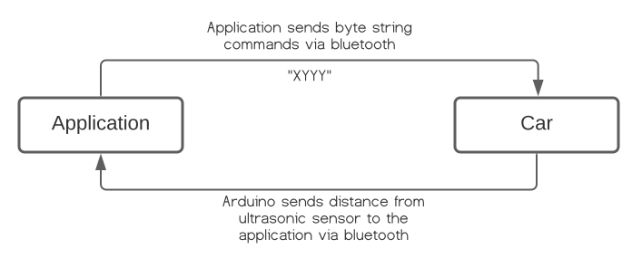

The arduino programmed in the car responds to these commands by taking following actions:
```
--- Direction commands ---
For Joystick / Accelerometer
  1 = Forward
  2 = Right
  3 = Backward
  4 = Left
  
For Voice commands
  5 = Forward
  6 = Right
  7 = Backward
  8 = Left
```

```
Let a 4 byte string "XYYY" is received,
  X = Direction commands.
  YYY = Speed (0 - 100) / Timer for voice control in seconds.
```

```
For example,
"1023" = Direction is Forward (1) | Speed is 23.
"4100" = Direction is Left (4) | Speed is 100.
"5003" = Direction is Forward for speech (5) | Motor will run for 3 seconds.
"7010" = Direction is Backward for speech (7) | Motor will run for 10 seconds.
"0000" = Stop.
```

<br>

### *Results*
First prototype.

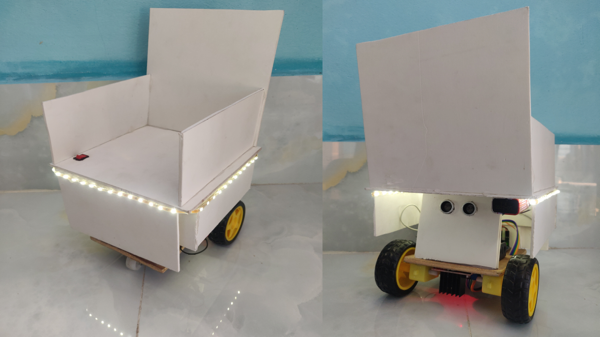

https://drive.google.com/drive/folders/1gYB2li1wmCzyNc5zTUUsbt-SgYqlr2lt?usp=sharing

*Licensed under [MIT License](LICENSE).*
